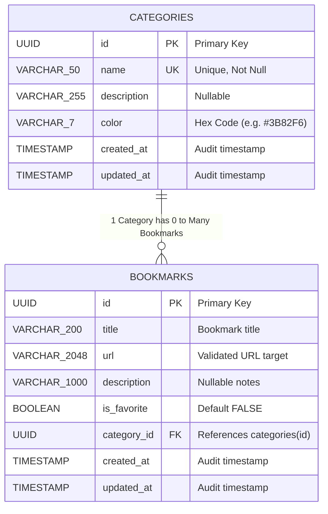

# 🔖 LinkVault — Relational Bookmarks & Categories API

LinkVault is a robust, production-grade RESTful API for managing web bookmarks organized into categories. Built with **Spring Boot 3.3**, **Java 21**, **PostgreSQL 16**, and **Spring Data JPA & Hibernate 6**.

---

## 🏛️ Database Design & Entity Relationship Diagram (ERD)

---

## 🛠️ Tech Stack & Architecture

- **Language:** Java 21 (LTS)
- **Framework:** Spring Boot 3.3.x
- **Persistence:** Spring Data JPA / Hibernate 6
- **Database:** PostgreSQL 16 (Docker Compose)
- **Migrations:** Flyway (Versioned DDL)
- **Connection Pool:** HikariCP
- **Validation:** Jakarta Validation with Custom Annotations (`@ValidUrl`, `@HexColor`)
- **Error Handling:** RFC 7807 `ProblemDetail`
- **Testing Pyramid:** JUnit 5, Mockito, AssertJ, `@DataJpaTest`, `@WebMvcTest`, Testcontainers
