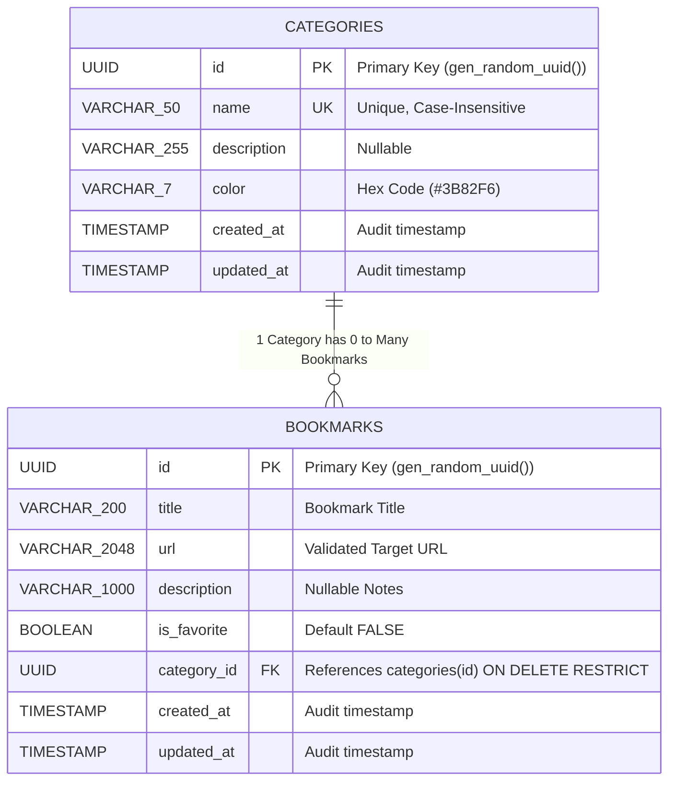

# LinkVault // Relational Bookmarks & Categories REST API

A robust, production-grade Relational Bookmarks & Categories REST API built with **Java 21 LTS**, **Spring Boot 3.3**, **PostgreSQL 16**, **Spring Data JPA & Hibernate 6**, **Flyway Versioned Migrations**, **Custom Jakarta Validators**, and **RFC 7807 ProblemDetail** error handling.

---

##  Features

- ** Clean Layered Architecture (`controller` → `service` → `repository` → `domain` / `dto`):**
  - Strict separation of concerns keeping presentation, business invariants, data access, and domain mapping decoupled.
  - **Constructor Injection & Interface Abstraction**: Services exposed via interfaces (`CategoryService`, `BookmarkService`) and implemented with constructor injection for testability without reflection.

- ** Relational Domain Modeling & N+1 Prevention (`domain/`, `repository/`):**
  - **`@ManyToOne(fetch = FetchType.LAZY)`**: Proper lazy-loading relationships between `Bookmark` and `Category`.
  - **`@EntityGraph` & `JOIN FETCH`**: High-performance eager joins eliminating the Hibernate N+1 query problem on list, search, and pagination endpoints.
  - **Domain Invariant & Cascades**: Foreign key constraint enforcement preventing orphaned bookmarks and restricting category deletion when bookmarks exist.
  - **Atomic Category Reassignment**: Bulk reassign bookmarks to a target category in a single atomic SQL update before deletion.

- ** Flyway Schema Versioning & PostgreSQL 16 (`db/migration/`):**
  - **`V1__create_categories_table.sql`**: Category table with unique constraints, check constraints, and UUID primary keys.
  - **`V2__create_bookmarks_table.sql`**: Bookmark table with foreign key indices (`idx_bookmarks_category_id`), title search index, and audit timestamp tracking.

- ** Custom Jakarta Bean Validation (`validation/`):**
  - **`@ValidUrl` / `ValidUrlValidator`**: Custom RFC-compliant URI validator enforcing valid schemes (`http`, `https`) and well-formed hostnames.
  - **`@HexColor` / `HexColorValidator`**: Regex-backed custom validator guaranteeing valid 6-character hex color codes (e.g. `#3B82F6`).

- ** Immutable Java 21 Records & DTO Pattern (`dto/`):**
  - **Information Hiding**: `CategoryCreateRequest`, `BookmarkCreateRequest`, `BookmarkUpdateRequest`, and `CategoryResponse` decouple internal persistence state from the public HTTP wire contract.
  - **Static Factory Mappers**: Encapsulated entity-to-DTO transformation methods (`BookmarkResponse.from(Bookmark)`).

- ** Centralized RFC 7807 Error Handling (`exception/GlobalExceptionHandler.java`):**
  - **Global Controller Advice (`@RestControllerAdvice`)**: Intercepts domain and validation exceptions across all endpoints.
  - **Standardized `ProblemDetail` JSON**: Emits IETF RFC 7807 error structures for `404 Not Found`, `409 Conflict`, `400 Bad Request`, and unexpected errors.
  - **Detailed Validation Errors**: Structures field-level constraint violations into an intuitive key-value map for frontend consumption.

- ** Comprehensive 3-Tier Testing Pyramid (69 Passing Tests):**
  - **Unit Tests (`service/`, `validation/`)**: 46 isolated tests for business rules and custom validators using **JUnit 5**, **Mockito**, and **AssertJ**.
  - **Data Slice Tests (`BookmarkRepositoryTest.java`)**: 3 tests using `@DataJpaTest` against live PostgreSQL verifying custom derived queries, `@EntityGraph` joins, and bulk update queries.
  - **Web Slice Tests (`controller/`)**: 19 tests using `@WebMvcTest` with **MockMvc** verifying HTTP status codes, JSONPath assertions, headers, and validation failures.
  - **End-to-End Integration Tests (`LinkVaultIntegrationTest.java`)**: Full HTTP request-to-database workflow test verifying Category CRUD, Bookmark assignment, relational deletion restrictions, and RFC 7807 problem details.

---

##  Tech Stack

- **Framework:** [Spring Boot 3.3.4](https://spring.io/projects/spring-boot)
- **Language:** [Java 21 LTS](https://openjdk.org/projects/jdk/21/)
- **Database:** [PostgreSQL 16](https://www.postgresql.org/) (Containerized via Docker Compose)
- **Persistence:** [Spring Data JPA](https://spring.io/projects/spring-data-jpa) & [Hibernate 6](https://hibernate.org/)
- **Migrations:** [Flyway](https://flywaydb.org/)
- **Connection Pool:** [HikariCP](https://github.com/brettwooldridge/HikariCP)
- **Validation:** [Jakarta Bean Validation](https://beanvalidation.org/) (Hibernate Validator)
- **Testing:** [JUnit 5](https://junit.org/junit5/), [AssertJ](https://assertj.github.io/doc/), [MockMvc](https://docs.spring.io/spring-framework/reference/testing/spring-mvc-test-framework.html), [Mockito](https://site.mockito.org/)
- **Error Standard:** [RFC 7807 Problem Details](https://datatracker.ietf.org/doc/html/rfc7807)

---

##  Database Design & Entity Relationship Diagram (ERD)



---

##  Project Architecture

```text
src/
├── main/
│   ├── java/com/linkvault/
│   │   ├── LinkVaultApplication.java                 # Spring Boot main application entrypoint
│   │   ├── controller/
│   │   │   ├── BookmarkController.java               # REST controller for Bookmarks (CRUD, search, filter)
│   │   │   └── CategoryController.java               # REST controller for Categories (CRUD, reassign)
│   │   ├── domain/
│   │   │   ├── BaseAuditEntity.java                  # @MappedSuperclass with createdAt & updatedAt
│   │   │   ├── Bookmark.java                         # JPA Entity with @ManyToOne(fetch = LAZY)
│   │   │   └── Category.java                         # JPA Entity with equals/hashCode on business key
│   │   ├── dto/
│   │   │   ├── BookmarkCreateRequest.java            # Validated incoming POST payload for Bookmarks
│   │   │   ├── BookmarkResponse.java                 # Output DTO with nested CategorySummaryResponse
│   │   │   ├── BookmarkUpdateRequest.java            # Validated incoming PUT payload for Bookmarks
│   │   │   ├── CategoryCreateRequest.java            # Validated incoming POST payload for Categories
│   │   │   ├── CategoryResponse.java                 # Full Category output DTO
│   │   │   ├── CategorySummaryResponse.java          # Compact Category DTO for nested bookmark responses
│   │   │   └── CategoryUpdateRequest.java            # Validated incoming PUT payload for Categories
│   │   ├── exception/
│   │   │   ├── CategoryNotEmptyException.java        # 409 Conflict domain exception
│   │   │   ├── DuplicateResourceException.java       # 409 Conflict duplicate name exception
│   │   │   ├── GlobalExceptionHandler.java           # @RestControllerAdvice with RFC 7807 ProblemDetail
│   │   │   └── ResourceNotFoundException.java        # 404 Not Found domain exception
│   │   ├── repository/
│   │   │   ├── BookmarkRepository.java               # @EntityGraph eager fetch queries & bulk update
│   │   │   └── CategoryRepository.java               # Derived queries & case-insensitive existence checks
│   │   ├── service/
│   │   │   ├── BookmarkService.java                  # Bookmark service interface
│   │   │   ├── CategoryService.java                  # Category service interface
│   │   │   └── impl/
│   │   │       ├── BookmarkServiceImpl.java          # Bookmark business logic & category linking
│   │   │       └── CategoryServiceImpl.java          # Category business logic & deletion invariants
│   │   └── validation/
│   │       ├── HexColor.java                         # Custom @HexColor annotation
│   │       ├── HexColorValidator.java                # Regex validator for #RRGGBB hex colors
│   │       ├── ValidUrl.java                         # Custom @ValidUrl annotation
│   │       └── ValidUrlValidator.java                # RFC URI validator for http/https URLs
│   └── resources/
│       ├── application.yml                           # Spring Boot datasource, JPA, & Flyway config
│       └── db/migration/
│           ├── V1__create_categories_table.sql       # Flyway migration: categories table & index
│           └── V2__create_bookmarks_table.sql        # Flyway migration: bookmarks table, FKs, & index
└── test/
    ├── java/com/linkvault/
    │   ├── LinkVaultApplicationTests.java            # ApplicationContext boot verification test
    │   ├── LinkVaultIntegrationTest.java             # Full E2E MockMvc & PostgreSQL integration workflow
    │   ├── controller/
    │   │   ├── BookmarkControllerTest.java           # WebMvc slice tests (Endpoints, pagination, validation)
    │   │   └── CategoryControllerTest.java           # WebMvc slice tests (Endpoints, 400, 404, 409)
    │   ├── repository/
    │   │   └── BookmarkRepositoryTest.java           # DataJpa slice tests (Eager fetch, reassign query)
    │   ├── service/
    │   │   ├── BookmarkServiceTest.java              # Unit tests with Mockito & AssertJ
    │   │   └── CategoryServiceTest.java              # Unit tests with Mockito & AssertJ
    │   └── validation/
    │       ├── HexColorValidatorTest.java            # Unit tests for @HexColor validator
    │       └── ValidUrlValidatorTest.java            # Unit tests for @ValidUrl validator
    └── resources/
        └── application-test.yml                      # Test environment configuration
```

---

##  REST API Endpoints

### Categories (`/api/v1/categories`)

| Method | Endpoint | Description | Status Code | Response |
| :--- | :--- | :--- | :--- | :--- |
| `POST` | `/api/v1/categories` | Create a new category | `201 Created` | `CategoryResponse` + `Location` Header |
| `GET` | `/api/v1/categories` | Retrieve all categories | `200 OK` | `List<CategoryResponse>` |
| `GET` | `/api/v1/categories/{id}` | Retrieve category by UUID | `200 OK` | `CategoryResponse` (or `404 ProblemDetail`) |
| `PUT` | `/api/v1/categories/{id}` | Update category by UUID | `200 OK` | `CategoryResponse` (or `404/409 ProblemDetail`) |
| `DELETE` | `/api/v1/categories/{id}` | Delete empty category | `204 No Content` | Empty Body (or `409 ProblemDetail` if bookmarks exist) |
| `PATCH` | `/api/v1/categories/{id}/reassign-and-delete?targetCategoryId={targetId}` | Reassign bookmarks & delete | `200 OK` | `{"reassignedCount": N}` |

### Bookmarks (`/api/v1/bookmarks`)

| Method | Endpoint | Description | Status Code | Response |
| :--- | :--- | :--- | :--- | :--- |
| `POST` | `/api/v1/bookmarks` | Create a bookmark under a category | `201 Created` | `BookmarkResponse` + `Location` Header |
| `GET` | `/api/v1/bookmarks` | Paginated bookmarks (filter by `categoryId`, `favoriteOnly`, `search`) | `200 OK` | `Page<BookmarkResponse>` |
| `GET` | `/api/v1/bookmarks/{id}` | Retrieve bookmark with eager category | `200 OK` | `BookmarkResponse` (or `404 ProblemDetail`) |
| `PUT` | `/api/v1/bookmarks/{id}` | Update bookmark fields or category | `200 OK` | `BookmarkResponse` (or `404 ProblemDetail`) |
| `PATCH` | `/api/v1/bookmarks/{id}/favorite` | Toggle bookmark favorite status | `200 OK` | `BookmarkResponse` (or `404 ProblemDetail`) |
| `DELETE` | `/api/v1/bookmarks/{id}` | Delete bookmark by UUID | `204 No Content` | Empty Body (or `404 ProblemDetail`) |

---

##  Getting Started

### Prerequisites
Make sure you have the following installed on your system:
- **Java JDK 21+**
- **Docker & Docker Compose** (for PostgreSQL)
- **Git**

### Installation & Running

1. **Clone the repository:**
   ```bash
   git clone https://github.com/richard-laktis/LinkVault-api.git
   cd LinkVault-api
   ```

2. **Start the PostgreSQL database container:**
   ```bash
   docker compose up -d
   ```

3. **Run the full automated test suite (69 tests):**
   ```bash
   # Windows PowerShell
   .\mvnw.cmd test

   # macOS / Linux
   ./mvnw test
   ```

4. **Start the development server:**
   ```bash
   # Windows PowerShell
   .\mvnw.cmd spring-boot:run

   # macOS / Linux
   ./mvnw spring-boot:run
   ```

5. **The API will be live and ready for requests at:**
   ```text
   http://localhost:8080/api/v1/categories
   http://localhost:8080/api/v1/bookmarks
   ```

6. **Build production executable JAR:**
   ```bash
   # Windows PowerShell
   .\mvnw.cmd clean package
   java -jar target/linkvault-api-0.0.1-SNAPSHOT.jar
   ```
